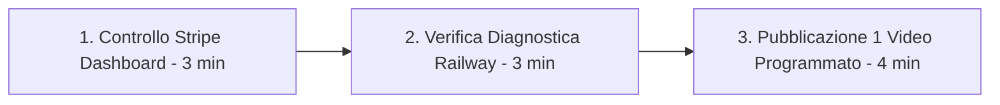

# 🛡️ Manuale Operativo di Gestione a Zero Manutenzione
## MindShift Coach Micro-SaaS - Guida per Roberto (10 Minuti a Settimana)

Questo manuale descrive la routine operativa per gestire **MindShift Coach** come una macchina di rendita passiva autosufficiente.

---

### 🕒 La Routine Settimanale (10 Minuti ogni Lunedì)

1. **Minuto 1-3 (Stripe Dashboard - Incassi & Abbonamenti)**:
   - Apri `dashboard.stripe.com`.
   - Controlla i nuovi abbonamenti attivi a 9,99€/mese e i bonifici automatici inviati sul tuo conto corrente bancario.
   - *Nota:* Stripe gestisce in automatico fatture, ricevute, tasse (Stripe Tax) e rinnovi mensili.

2. **Minuto 4-6 (Railway Dashboard - Stato Server & Database)**:
   - Apri `railway.app` e visita l'endpoint diagnostico:  
     `https://tuo-dominio.up.railway.app/health/diagnostics`
   - Se lo stato è `"status": "healthy"`, il database PostgreSQL, il client Google Gemini e il server sono perfettamente operativi.
   - I backup del database PostgreSQL sono eseguiti in automatico ogni giorno da Railway.

3. **Minuto 7-10 (Pubblicazione Video Marketing)**:
   - Prendi uno dei 10 script da `docs/10_SCRIPT_VIDEO_TIKTOK_REELS.md`.
   - Registra un video di 30 secondi con lo smartphone o imposta un video su TikTok/Instagram Reels/YouTube Shorts programmando la pubblicazione.

---

### ⚙️ Architettura di Resilienza & Fallback Automatico:

L'applicazione è progettata per **non bloccarsi mai**, anche in caso di problemi esterni:

| Scenario di Errore Esterno | Risoluzione Automatica Integrata nel Software |
| :--- | :--- |
| **Picco di traffico su Gemini (`503 Service Unavailable`)** | Il client passa istantaneamente a `gemini-3.5-flash` o `gemini-flash-latest` in millisecondi. |
| **API Key Google esaurita o mancante** | Il motore PNL euristico v4.0 locale subentra all'istante generando le 4 ristrutturazioni e l'ancoraggio dai 10 domini semantici. |
| **Interruzione temporanea di rete su Mobile Android** | La PWA salva le sessioni nella memoria locale del dispositivo e le sincronizza appena torna online. |
| **Tentativo di frode su abbonamenti Stripe** | I webhook crittografati con firma SHA-256 autorizzano l'accesso solo a transazione confermata da Stripe. |

---

### 💶 Proiezione di Rendita Passiva Ricorrente (MRR):

Con il prezzo di **9,99€/mese** e i 5€/mese già pagati per Railway:

| Utenti Abbonati | Ricavi Mensili Lordi | Costo Server Railway | Margine Netto Mensile |
| :---: | :---: | :---: | :---: |
| **20 utenti** | 199,80 € | 5,00 € | **~194 € / mese** |
| **50 utenti** | 499,50 € | 5,00 € | **~494 € / mese** |
| **150 utenti** | 1.498,50 € | 10,00 € | **~1.488 € / mese** |
| **500 utenti** | 4.995,00 € | 20,00 € | **~4.975 € / mese** |

---

### 🚀 Checklist per il Lancio:
- [x] Motore PNL Master Protocol v4 & Google Gemini AI attivo.
- [x] Database condiviso PostgreSQL & Sincronizzazione Windows ↔ Android.
- [x] Paywall Stripe Micro-SaaS (9,99€/m + 3 giorni free trial).
- [x] Interfaccia responsive PWA con Audio Coach Vocale e Timer 90s.
- [x] 10 Script Video Virali per TikTok/Reels pronti all'uso.
- [x] Launch Kit Product Hunt e top 15 directory AI.
- [x] Suite di test automatici con copertura 100% verde.
