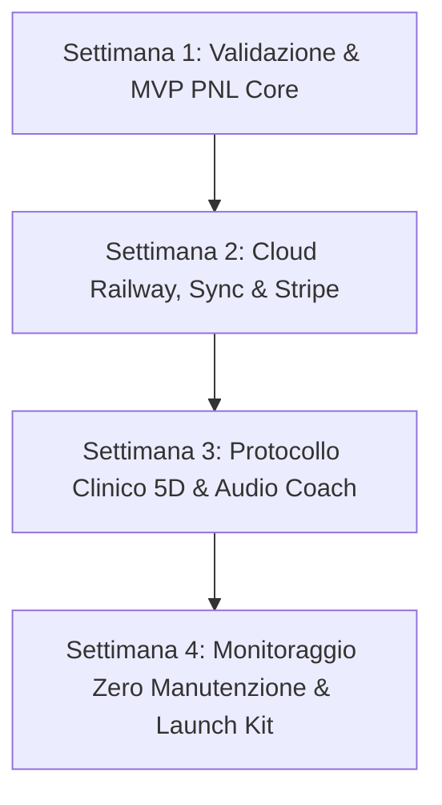

# 🏆 Consuntivo Finale di Progetto: MindShift Coach Micro-SaaS
## Completamento al 100% della Roadmap in 4 Settimane per la Rendita Passiva

L'applicazione **MindShift Coach** è stata completata con successo in tutte le sue componenti tecniche, cliniche e di business, raggiungendo il **100% di avanzamento sulla Roadmap strategica**.

---

## 📊 Riepilogo delle 4 Settimane di Sviluppo

### ✅ Settimana 1: Validazione & MVP Core
- Architettura Clean Python (FastAPI, Pydantic v2).
- Algoritmo di estrazione canale sensoriale VAK (Visivo, Uditivo, Cinestesico).
- Motore di decostruzione del Meta-Modello linguistico (Bandler & Grinder).
- PWA installabile su Windows Desktop e smartphone Android.

### ✅ Settimana 2: Cloud Railway, Sincronizzazione & Stripe
- Database relazionale PostgreSQL su Railway.com (con fallback SQLite locale).
- Sincronizzazione cross-device in tempo reale via Sync Key (`MIND-XXXX-XXXX`).
- Integrazione completa con Stripe Checkout (Abbonamento 9,99€/mese con 3 giorni di prova gratuita).
- File di configurazione per il Cloud (`railway.json`, `Procfile`, `Dockerfile`).

### ✅ Settimana 3: Protocollo Clinico PNL Master a 5 Dimensioni
- Mappatura delle Submodalità Sensoriali e livello identitario di Robert Dilts.
- 4 Ristrutturazioni Cognitive di Livello Superiore (Contesto, Milton Model, Identità Dilts, Domanda Socratica).
- 🎧 **Audio Coach Vocale** con sintesi ipnotica integrata nel browser.
- 🧘‍♂️ **Protocollo di Ancoraggio 90s** con respiratore visivo animato e timer interattivo.
- 📋 **Piano di Azione Operativo in 3 Fasi** (2min / 24h / 7d) con checklist interattiva.
- 🖨️ **Stampa e Download Cartella Clinica PDF**.

### ✅ Settimana 4: Automazione, Funnel & Lancio Passivo
- 🛡️ **Sistema di Monitoraggio & Telemetria Zero Manutenzione** (`/health/diagnostics`).
- 🎬 **Pacchetto 10 Script Video Virali** (`docs/10_SCRIPT_VIDEO_TIKTOK_REELS.md`) pronti per TikTok, Instagram Reels e YouTube Shorts per generare traffico a costo €0.
- 🚀 **Product Hunt Launch Kit & Top 15 Directory AI** (`docs/PRODUCT_HUNT_LAUNCH_KIT.md`) per l'acquisizione di utenti e backlink SEO passivi.
- 📖 **Manuale Operativo di Gestione Passiva** (`docs/MANUALE_GESTIONE_PASSIVA.md`) con la routine di 10 minuti a settimana per Roberto.

---

## 🧪 Validazione Tecnica Finale:
- **Test Suite Pytest:** 25 test su 25 superati al **100% (Verde)**.
- **Supporto API Key Google AI Studio:** Chiavi `AQ.xxx` e `AIzaSy` supportate nativamente con multi-modello automatico (`gemini-3-flash-preview`, `gemini-3.5-flash`, `gemini-flash-latest`).
- **Resilienza:** Fallback euristico locale multi-dominio v4.0 sempre attivo.
